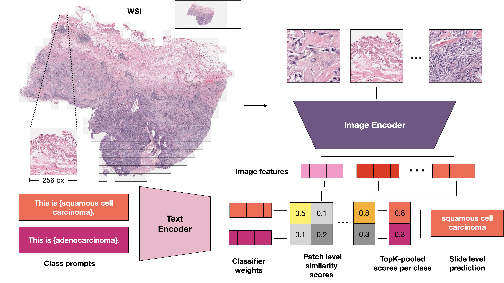

MI-Zero: Visual Language Pretrained Multiple Instance Zero-Shot Transfer for Histopathology Images
===

## Information



<p align = "left">
Figure 1. Schematic of MI-Zero. A gigapixel WSI is converted to a collection of patches (instances), each embedded into an aligned
visual-language latent space. In the set-based representation, the similarity scores between patch embeddings and prompt embeddings
are aggregated via a permutation invariant operator such as topK max-pooling to produce the WSI-level classification prediction. Alternatively, a graph-based representation may be used to incorporate spatial context by first aggregating predictions in local neighborhoods
(Section 3.5 of paper for more details).
</p>

## Installation
Tested on:
- pytorch: 1.13.0
- transformers: 4.19.3

We provide an illustrative example of MI-Zero in **MI-Zero_illustrated** for reviewers' convenience. We plan to refactor the complete inference script  and make it available together with model weights closer to publication.

Clone the repository with:

```{bash}
git clone https://github.com/anonid12345/MI-Zero
```

